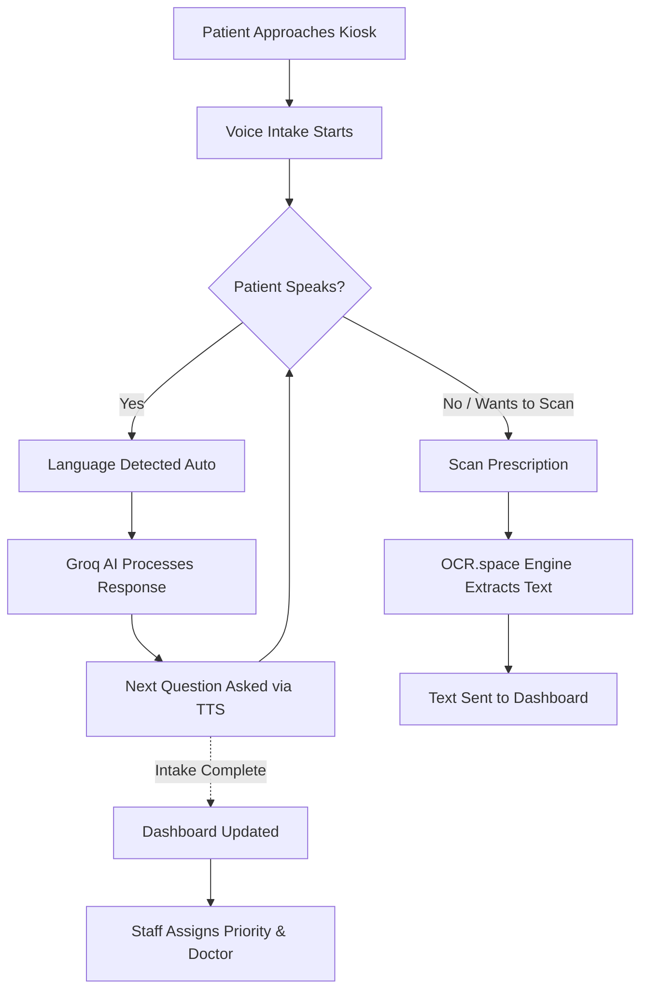

# C.A.R.E. (Completely Automated Reception Engine) 🏥

C.A.R.E. is a next-generation, fully automated AI-powered hospital kiosk designed to streamline patient intake, reduce receptionist workload, and provide a seamless, multilingual experience for patients in India.

## ✨ Features

- 🗣️ **Multilingual Voice Intake**: Automatically detects and speaks Hindi, Tamil, and English (including Hinglish).
- 🧠 **AI-Powered Conversation**: Uses Groq (Llama 3) for lightning-fast, intelligent, and context-aware patient conversations.
- 📝 **Handwritten Prescription OCR**: Integrates OCR.space (Engine 3) to accurately scan and transcribe doctors' handwritten prescriptions and tables in Hindi and English.
- ⚡ **Zero-Touch Kiosk**: Patients can complete their entire intake process purely using their voice, without touching the screen.
- 📊 **Real-time Staff Dashboard**: Instantly syncs patient data, triage priority, and scanned prescriptions to the doctor's dashboard.

---

## 🔄 Workflow

---

## 🏗️ Architecture

C.A.R.E. is currently designed as a **Static Frontend MVP** tailored for immediate, server-less deployment on kiosk devices.

- **Frontend:** Vanilla HTML, CSS, JavaScript
- **Voice Recognition:** Web Speech API
- **Text-to-Speech:** Window.speechSynthesis
- **LLM/Chat:** Groq API (Llama 3 8B/70B)
- **Vision/OCR:** OCR.space Engine 3 (Optimized for Handwriting)
- **Data Storage:** LocalStorage (Simulating a real-time database)

---

## 🚀 Deployment (GitHub Pages)

Since C.A.R.E. is a pure frontend application, it can be deployed on GitHub pages with zero configuration.

1. Clone the repository
2. Push to the `main` branch
3. Enable GitHub Pages in the repository settings (Settings -> Pages -> Deploy from a branch).

## 🛠️ Setup & Configuration (For Kiosks)

1. Open the application.
2. Press `Ctrl + Shift + S` or click the hidden settings icon to open the API Configuration Modal.
3. Add your **Groq API Key** (for Voice Chat).
4. Add your **OCR.space API Key** (for Scanning).
5. The settings are saved locally and persist across reloads.

---
*Built for the future of Indian Healthcare.*
